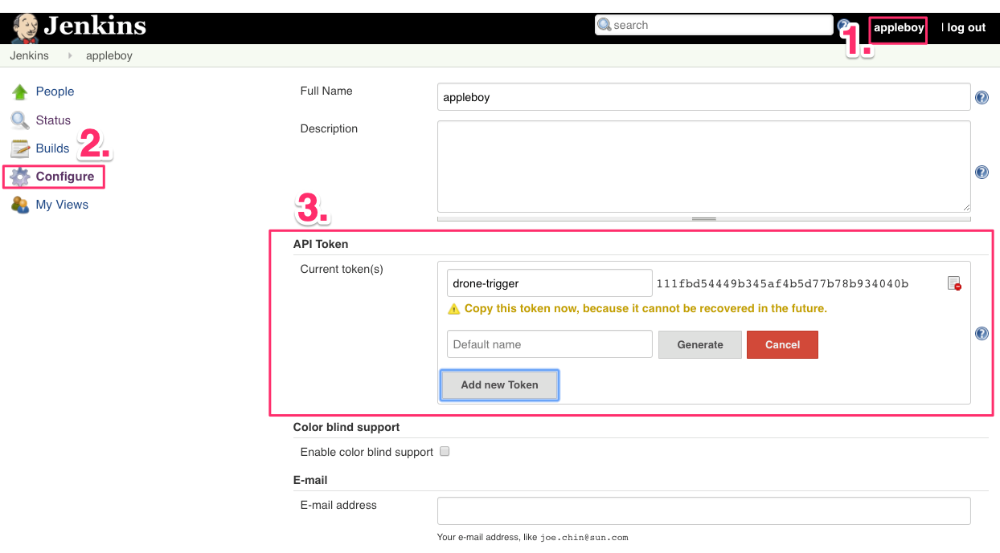

# drone-jenkins


[](https://github.com/appleboy/drone-jenkins/actions/workflows/lint.yml)
[](https://godoc.org/github.com/appleboy/drone-jenkins)
[](https://codecov.io/gh/appleboy/drone-jenkins)
[](https://goreportcard.com/report/github.com/appleboy/drone-jenkins)

[Drone](https://github.com/drone/drone) plugin for trigger [Jenkins](https://jenkins.io/) jobs.

## Setup the Jenkins Server

Setup the Jenkins server using the docker command:

```sh
$ docker run \
  --name jenkins \
  -d --restart always \
  -p 8080:8080 -p 50000:50000 \
  -v /data/jenkins:/var/jenkins_home \
  jenkins/jenkins:lts
```

Please make sure that you create the `/data/jenkins` before starting the Jenkins. Create the new API token as below:



## Build or Download a binary

The pre-compiled binaries can be downloaded from [release page](https://github.com/appleboy/drone-jenkins/releases). Support the following OS type.

* Windows amd64/386
* Linux amd64/386
* Darwin amd64/386

With `Go` installed

```sh
go install github.com/appleboy/drone-jenkins
```

or build the binary with the following command:

```sh
make build
```

## Docker

Build the docker image with the following commands:

```sh
make docker
```

## Usage

There are three ways to trigger jenkins jobs.

### Usage from binary

trigger single job.

```bash
drone-jenkins \
  --host http://jenkins.example.com/ \
  --user appleboy \
  --token XXXXXXXX \
  --job drone-jenkins-plugin
```

trigger multiple jobs.

```bash
drone-jenkins \
  --host http://jenkins.example.com/ \
  --user appleboy \
  --token XXXXXXXX \
  --job drone-jenkins-plugin-1 \
  --job drone-jenkins-plugin-2
```

### Usage from docker

trigger single job.

```bash
docker run --rm \
  -e JENKINS_BASE_URL=http://jenkins.example.com/
  -e JENKINS_USER=appleboy
  -e JENKINS_TOKEN=xxxxxxx
  -e JENKINS_JOB=drone-jenkins-plugin
  ghcr.io/appleboy/drone-jenkins
```

trigger multiple jobs.

```bash
docker run --rm \
  -e JENKINS_BASE_URL=http://jenkins.example.com/
  -e JENKINS_USER=appleboy
  -e JENKINS_TOKEN=xxxxxxx
  -e JENKINS_JOB=drone-jenkins-plugin-1,drone-jenkins-plugin-2
  ghcr.io/appleboy/drone-jenkins
```

### Usage from drone ci

Execute from the working directory:

```sh
docker run --rm \
  -e PLUGIN_URL=http://example.com \
  -e PLUGIN_USER=xxxxxxx \
  -e PLUGIN_TOKEN=xxxxxxx \
  -e PLUGIN_JOB=xxxxxxx \
  -v $(pwd):$(pwd) \
  -w $(pwd) \
  ghcr.io/appleboy/drone-jenkins
```

You can get more [information](DOCS.md) about how to use scp plugin in drone.

## Testing

Test the package with the following command:

```sh
make test
```
