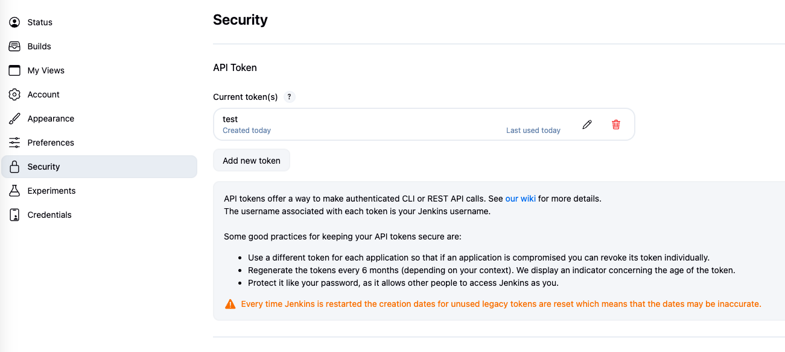

# drone-jenkins

[English](README.md) | [繁體中文](README.zh-TW.md) | [简体中文](README.zh-CN.md)


[](https://github.com/appleboy/drone-jenkins/actions/workflows/lint.yml)
[](https://github.com/appleboy/drone-jenkins/actions/workflows/trivy.yml)
[](https://godoc.org/github.com/appleboy/drone-jenkins)
[](https://codecov.io/gh/appleboy/drone-jenkins)
[](https://goreportcard.com/report/github.com/appleboy/drone-jenkins)

一個用於觸發 [Jenkins](https://jenkins.io/) 任務的 CLI 工具與 CI/CD 外掛。支援 [GitHub Actions](https://github.com/features/actions)、[GitLab CI](https://docs.gitlab.com/ee/ci/)、[Gitea Action](https://docs.gitea.com/usage/actions/overview) 以及任何支援 Docker 容器或 Shell 命令的平台。

## 為什麼選擇 drone-jenkins？

在現代企業環境中，團隊經常根據特定需求、專案要求或歷史決策採用不同的 CI/CD 平台。常見的情況包括：

- **多個 CI 平台並存**：有些團隊因為 Jenkins 豐富的外掛生態系統而使用它，而其他團隊則偏好 GitHub Actions 或 GitLab CI 的簡潔性和容器原生方式。
- **舊有系統整合**：擁有既有 Jenkins 流水線的組織需要與新的 CI/CD 工作流程整合，而不需要重寫所有內容。
- **跨團隊協作**：不同部門可能標準化使用不同的工具，需要平台之間的無縫溝通。

**drone-jenkins** 彌補了這個差距，讓 CI/CD 流水線能夠將觸發 Jenkins 任務作為工作流程的一部分。它可以與 **GitHub Actions**、**GitLab CI**、**Gitea Action** 以及任何支援 Docker 容器或 Shell 命令的 CI 平台無縫協作。

這使得以下情境成為可能：

- **統一的部署流水線**：從任何 CI 平台觸發現有的 Jenkins 部署任務，無需遷移
- **漸進式遷移**：團隊可以逐步遷移到現代 CI 平台，同時繼續使用 Jenkins 任務
- **兩全其美**：使用 GitHub Actions 或 GitLab CI 進行現代容器化建置，並使用 Jenkins 處理需要特定外掛的專門任務
- **集中式協調**：從單一流水線協調跨多個 CI 系統的建置
- **彈性使用**：提供 CLI 執行檔或 Docker 映像檔——依照您的工作流程選擇使用方式

無論您是在管理混合 CI/CD 環境還是協調複雜的多平台部署，drone-jenkins 都能提供您所需的連接能力。

## 目錄

- [drone-jenkins](#drone-jenkins)
  - [為什麼選擇 drone-jenkins？](#為什麼選擇-drone-jenkins)
  - [目錄](#目錄)
  - [功能特色](#功能特色)
  - [先決條件](#先決條件)
  - [安裝](#安裝)
    - [下載執行檔](#下載執行檔)
    - [從原始碼建置](#從原始碼建置)
    - [Docker 映像檔](#docker-映像檔)
  - [設定](#設定)
    - [Jenkins 伺服器設定](#jenkins-伺服器設定)
    - [認證](#認證)
    - [參數參考](#參數參考)
  - [使用方式](#使用方式)
    - [命令列](#命令列)
    - [Docker](#docker)
  - [開發](#開發)
    - [建置](#建置)
    - [測試](#測試)
  - [授權條款](#授權條款)
  - [貢獻](#貢獻)

## 功能特色

- 觸發單一或多個 Jenkins 任務
- 支援 Jenkins 建置參數
- 多種認證方式（API 令牌或遠端觸發令牌）
- 等待任務完成，可設定輪詢間隔和逾時時間
- 除錯模式，顯示詳細參數資訊並安全遮蔽令牌
- SSL/TLS 支援，可使用自訂 CA 憑證（PEM 內容、檔案路徑或 URL）
- 跨平台支援（Linux、macOS、Windows）
- 提供 CLI 執行檔或 Docker 映像檔

## 先決條件

- Jenkins 伺服器（建議版本 2.0 或更新版本）
- 用於認證的 Jenkins API 令牌或遠端觸發令牌
- 對於 Jenkins 設定，建議使用 Docker，但非必要

## 安裝

### 下載執行檔

預先編譯的執行檔可從[發布頁面](https://github.com/appleboy/drone-jenkins/releases)下載，支援：

- **Linux**: amd64, 386
- **macOS (Darwin)**: amd64, 386
- **Windows**: amd64, 386

如果已安裝 Go，也可以直接安裝：

```sh
go install github.com/appleboy/drone-jenkins@latest
```

### 從原始碼建置

複製儲存庫並建置：

```sh
git clone https://github.com/appleboy/drone-jenkins.git
cd drone-jenkins
make build
```

### Docker 映像檔

建置 Docker 映像檔：

```sh
make docker
```

或拉取預先建置的映像檔：

```sh
docker pull ghcr.io/appleboy/drone-jenkins
```

## 設定

### Jenkins 伺服器設定

使用 Docker 設定 Jenkins 伺服器：

```sh
docker run -d -v jenkins_home:/var/jenkins_home -p 8080:8080 -p 50000:50000 --restart=on-failure jenkins/jenkins:slim
```

### 認證

建議使用 Jenkins API 令牌進行認證。建立 API 令牌的步驟：

1. 登入 Jenkins
2. 點擊右上角的使用者名稱
3. 選擇「安全性」
4. 在「API 令牌」下，點擊「新增令牌」
5. 輸入名稱並點擊「產生」
6. 複製產生的令牌



或者，您可以使用在 Jenkins 任務設定中配置的遠端觸發令牌。

### 參數參考

| 參數          | CLI 旗標             | 環境變數                                        | 必要          | 說明                                                                      |
| ------------- | -------------------- | ----------------------------------------------- | ------------- | ------------------------------------------------------------------------- |
| Host          | `--host`             | `PLUGIN_URL`, `JENKINS_URL`                     | 是            | Jenkins 基礎 URL（例如 `http://jenkins.example.com/`）                    |
| User          | `--user`, `-u`       | `PLUGIN_USER`, `JENKINS_USER`                   | 條件式\*      | Jenkins 使用者名稱                                                        |
| Token         | `--token`, `-t`      | `PLUGIN_TOKEN`, `JENKINS_TOKEN`                 | 條件式\*      | Jenkins API 令牌                                                          |
| Remote Token  | `--remote-token`     | `PLUGIN_REMOTE_TOKEN`, `JENKINS_REMOTE_TOKEN`   | 條件式\*      | Jenkins 遠端觸發令牌                                                      |
| Job           | `--job`, `-j`        | `PLUGIN_JOB`, `JENKINS_JOB`                     | 是            | Jenkins 任務名稱 - 可指定多個                                             |
| Parameters    | `--parameters`, `-p` | `PLUGIN_PARAMETERS`, `JENKINS_PARAMETERS`       | 否            | 建置參數，多行 `key=value` 格式（每行一個）                               |
| Insecure      | `--insecure`         | `PLUGIN_INSECURE`, `JENKINS_INSECURE`           | 否            | 允許不安全的 SSL 連線（預設：false）                                      |
| CA Cert       | `--ca-cert`          | `PLUGIN_CA_CERT`, `JENKINS_CA_CERT`             | 否            | 自訂 CA 憑證（PEM 內容、檔案路徑或 HTTP URL）                             |
| Wait          | `--wait`             | `PLUGIN_WAIT`, `JENKINS_WAIT`                   | 否            | 等待任務完成（預設：false）                                               |
| Poll Interval | `--poll-interval`    | `PLUGIN_POLL_INTERVAL`, `JENKINS_POLL_INTERVAL` | 否            | 狀態檢查間隔（預設：10s）                                                 |
| Timeout       | `--timeout`          | `PLUGIN_TIMEOUT`, `JENKINS_TIMEOUT`             | 否            | 等待任務完成的最長時間（預設：30m）                                       |
| Debug         | `--debug`            | `PLUGIN_DEBUG`, `JENKINS_DEBUG`                 | 否            | 啟用除錯模式以顯示詳細參數資訊（預設：false）                             |

**認證要求**：您必須提供以下其中一種：

- `user` + `token`（API 令牌認證），或
- `remote-token`（遠端觸發令牌認證）

**參數格式**：`parameters` 欄位接受多行字串，每行包含一個 `key=value` 配對：

- 每個參數應該在單獨一行
- 格式：`KEY=VALUE`（每行一個）
- 空行會自動忽略
- 只有空白的行會被跳過
- 鍵名會去除前後空白
- 值會保留有意義的空格
- 值可以包含 `=` 符號（第一個 `=` 之後的所有內容都視為值）

## 使用方式

### 命令列

**單一任務：**

```bash
drone-jenkins \
  --host http://jenkins.example.com/ \
  --user appleboy \
  --token XXXXXXXX \
  --job drone-jenkins-plugin
```

**多個任務：**

```bash
drone-jenkins \
  --host http://jenkins.example.com/ \
  --user appleboy \
  --token XXXXXXXX \
  --job drone-jenkins-plugin-1 \
  --job drone-jenkins-plugin-2
```

**帶建置參數：**

```bash
drone-jenkins \
  --host http://jenkins.example.com/ \
  --user appleboy \
  --token XXXXXXXX \
  --job my-jenkins-job \
  --parameters $'ENVIRONMENT=production\nVERSION=1.0.0'
```

或使用環境變數：

```bash
export JENKINS_PARAMETERS="ENVIRONMENT=production
VERSION=1.0.0
BRANCH=main"

drone-jenkins \
  --host http://jenkins.example.com/ \
  --user appleboy \
  --token XXXXXXXX \
  --job my-jenkins-job
```

**使用遠端令牌認證：**

```bash
drone-jenkins \
  --host http://jenkins.example.com/ \
  --remote-token REMOTE_TOKEN_HERE \
  --job my-jenkins-job
```

**等待任務完成：**

```bash
drone-jenkins \
  --host http://jenkins.example.com/ \
  --user appleboy \
  --token XXXXXXXX \
  --job my-jenkins-job \
  --wait \
  --poll-interval 15s \
  --timeout 1h
```

**使用除錯模式：**

```bash
drone-jenkins \
  --host http://jenkins.example.com/ \
  --user appleboy \
  --token XXXXXXXX \
  --job my-jenkins-job \
  --debug
```

**使用自訂 CA 憑證：**

```bash
# 使用檔案路徑
drone-jenkins \
  --host https://jenkins.example.com/ \
  --user appleboy \
  --token XXXXXXXX \
  --job my-jenkins-job \
  --ca-cert /path/to/ca.pem

# 使用 URL
drone-jenkins \
  --host https://jenkins.example.com/ \
  --user appleboy \
  --token XXXXXXXX \
  --job my-jenkins-job \
  --ca-cert https://example.com/ca-bundle.crt
```

### Docker

**單一任務：**

```bash
docker run --rm \
  -e JENKINS_URL=http://jenkins.example.com/ \
  -e JENKINS_USER=appleboy \
  -e JENKINS_TOKEN=xxxxxxx \
  -e JENKINS_JOB=drone-jenkins-plugin \
  ghcr.io/appleboy/drone-jenkins
```

**多個任務：**

```bash
docker run --rm \
  -e JENKINS_URL=http://jenkins.example.com/ \
  -e JENKINS_USER=appleboy \
  -e JENKINS_TOKEN=xxxxxxx \
  -e JENKINS_JOB=drone-jenkins-plugin-1,drone-jenkins-plugin-2 \
  ghcr.io/appleboy/drone-jenkins
```

**帶建置參數：**

```bash
docker run --rm \
  -e JENKINS_URL=http://jenkins.example.com/ \
  -e JENKINS_USER=appleboy \
  -e JENKINS_TOKEN=xxxxxxx \
  -e JENKINS_JOB=my-jenkins-job \
  -e JENKINS_PARAMETERS=$'ENVIRONMENT=production\nVERSION=1.0.0\nBRANCH=main' \
  ghcr.io/appleboy/drone-jenkins
```

**等待任務完成：**

```bash
docker run --rm \
  -e JENKINS_URL=http://jenkins.example.com/ \
  -e JENKINS_USER=appleboy \
  -e JENKINS_TOKEN=xxxxxxx \
  -e JENKINS_JOB=my-jenkins-job \
  -e JENKINS_WAIT=true \
  -e JENKINS_POLL_INTERVAL=15s \
  -e JENKINS_TIMEOUT=1h \
  ghcr.io/appleboy/drone-jenkins
```

**使用除錯模式：**

```bash
docker run --rm \
  -e JENKINS_URL=http://jenkins.example.com/ \
  -e JENKINS_USER=appleboy \
  -e JENKINS_TOKEN=xxxxxxx \
  -e JENKINS_JOB=my-jenkins-job \
  -e JENKINS_DEBUG=true \
  ghcr.io/appleboy/drone-jenkins
```

**使用自訂 CA 憑證：**

```bash
# 使用掛載的憑證檔案
docker run --rm \
  -v /path/to/ca.pem:/ca.pem:ro \
  -e JENKINS_URL=https://jenkins.example.com/ \
  -e JENKINS_USER=appleboy \
  -e JENKINS_TOKEN=xxxxxxx \
  -e JENKINS_JOB=my-jenkins-job \
  -e JENKINS_CA_CERT=/ca.pem \
  ghcr.io/appleboy/drone-jenkins

# 使用 URL
docker run --rm \
  -e JENKINS_URL=https://jenkins.example.com/ \
  -e JENKINS_USER=appleboy \
  -e JENKINS_TOKEN=xxxxxxx \
  -e JENKINS_JOB=my-jenkins-job \
  -e JENKINS_CA_CERT=https://example.com/ca-bundle.crt \
  ghcr.io/appleboy/drone-jenkins
```

更多詳細範例和進階設定，請參閱 [DOCS.md](DOCS.md)。

## 開發

### 建置

建置執行檔：

```sh
make build
```

建置 Docker 映像檔：

```sh
make docker
```

### 測試

執行測試套件：

```sh
make test
```

執行測試並產生覆蓋率報告：

```sh
make test-coverage
```

## 授權條款

Copyright (c) 2019 Bo-Yi Wu

## 貢獻

歡迎貢獻！請隨時提交 Pull Request。
